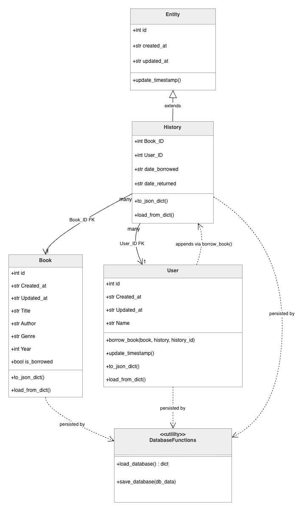

# Product Requirements Document — Book Library System

## Overview

The Book Library System is a lightweight, single-file Python application for managing a physical book collection. It tracks books, registered users, and borrow history, persisting all state to a local JSON file between runs.

---

## Goals

- Provide a simple, dependency-free library management tool runnable from any Python 3 environment.
- Maintain a reliable audit trail of every borrow event.
- Enforce data integrity through primary key validation.
- Keep the architecture readable and extendable without external frameworks.

---

## Architecture

The system is organized around four classes and a database layer:

| Component | Role |
|-----------|------|
| `Entity` | Base class providing `id`, timestamps, and `update_timestamp()` |
| `History` | Extends `Entity`; one record per borrow event |
| `Book` | Independent model; holds book metadata and borrow status |
| `User` | Independent model; initiates borrow operations |
| `load_database()` / `save_database()` | Reads and writes all collections to `db.json` |

### Inheritance & Relationships

- `History` inherits from `Entity`.
- `Book` and `User` are fully independent (no shared base class).
- `History` holds foreign keys `Book_ID` and `User_ID` linking borrow events to their book and user.
- `User.borrow_book()` mutates the `Book.is_borrowed` flag and appends a `History` entry in a single operation.

---

## Data Models

### Book

| Field | Type | Key |
|-------|------|-----|
| `id` | int | PK |
| `Created_at` | str | — |
| `Updated_at` | str | — |
| `Title` | str | — |
| `Author` | str | — |
| `Genre` | str | — |
| `Year` | int | — |
| `is_borrowed` | bool | — |

### User

| Field | Type | Key |
|-------|------|-----|
| `id` | int | PK |
| `Created_at` | str | — |
| `Updated_at` | str | — |
| `Name` | str | — |

### History

| Field | Type | Key |
|-------|------|-----|
| `id` | int | PK |
| `Book_ID` | int | FK → Book |
| `User_ID` | int | FK → User |
| `date_borrowed` | str | — |
| `date_returned` | str \| null | — |

---

## Functional Requirements

### FR-1 — Book Management
- The system must store books with title, author, genre, year, and borrow status.
- Books must have a unique integer primary key (`id`).
- Borrow status (`is_borrowed`) must reflect real-time state across runs.

### FR-2 — User Management
- Users must be identifiable by a unique integer primary key (`id`).
- A user's `Updated_at` timestamp must be refreshed when they perform a borrow.

### FR-3 — Borrow Operation
- `User.borrow_book(book, history, history_id)` must:
  1. Reject the operation if `history_id` already exists in the history list (PK violation guard).
  2. Reject the operation if the book is already borrowed.
  3. Mark the book as borrowed (`is_borrowed = True`).
  4. Append a new `History` record with `date_borrowed` set to the current timestamp and `date_returned` set to `null`.

### FR-4 — Data Persistence
- On every successful borrow, all three collections — books, users, and history — must be serialized and written to `db.json` atomically in a single `save_database()` call.
- `db.json` must be auto-created with seed data (4 books, 4 users, empty history) if it does not exist on startup.

### FR-5 — Serialization
- All models must implement `to_json_dict()` and `load_from_dict()` using the exact case-sensitive key names defined in the data model tables above.
- `load_from_dict()` must use the mutating instance pattern: create a dummy instance, call `load_from_dict(data)` on it, and return the populated object.

---

## Non-Functional Requirements

| Requirement | Detail |
|-------------|--------|
| Dependencies | None — Python standard library only (`datetime`, `json`, `os`) |
| Python version | Python 3.8+ |
| File size | Single source file (`book_library.py`) |
| Storage | Local `db.json`; no external database required |

---

## Out of Scope

- Return/check-in of borrowed books (future feature; `date_returned` field is reserved)
- Search or filter operations on books or users
- Authentication or multi-user access control
- Web or GUI interface
- Concurrent write safety
